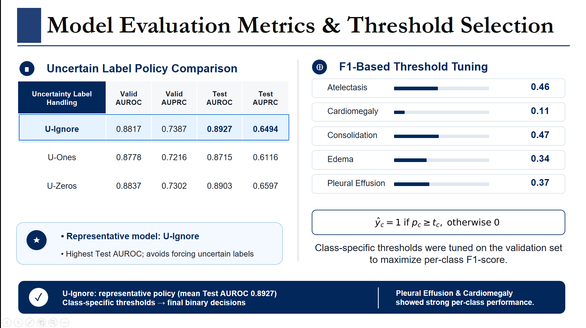
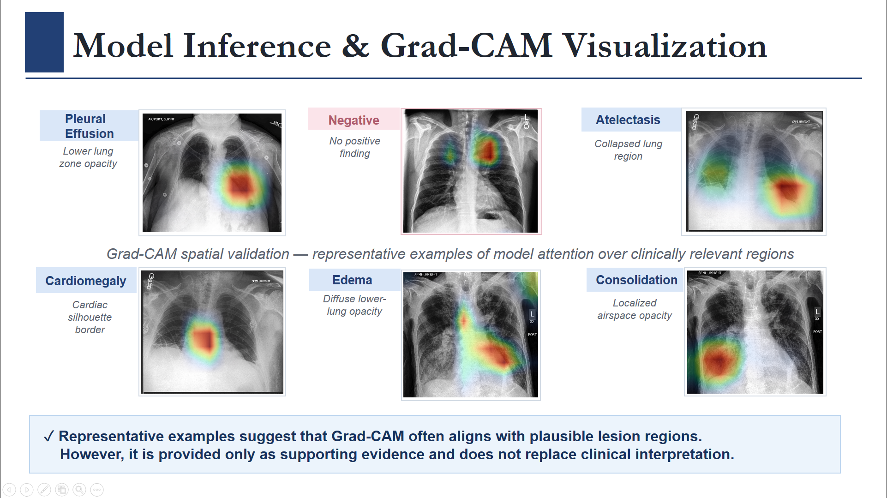

# CheXpert PoC

DenseNet121-based multi-label chest X-ray classification pipeline using the CheXpert-small dataset.

This repository is the research and experiment codebase for the capstone project.  
The production web service is managed separately in `capstone-cxr`.

## Project Overview

This project trains and evaluates a chest X-ray classification model for five CheXpert target findings:

- Atelectasis
- Cardiomegaly
- Consolidation
- Edema
- Pleural Effusion

The model predicts class-wise probabilities and supports Grad-CAM visualization for explainable inference.

## Main Features

- CheXpert-small data loading
- Frontal-view-only training policy
- DenseNet121 multi-label classifier
- Uncertainty label policy comparison: U-Ignore, U-Ones, U-Zeros
- BCEWithLogitsLoss with `pos_weight`
- AUROC and AUPRC evaluation
- F1-based threshold tuning
- Image-level inference
- Grad-CAM visualization
- Reusable inference service functions for later migration

## Repository Structure

```text
chexpert_poc/
├── chexpert_poc/
│   ├── common/          # config, runtime, shared utilities
│   ├── datasets/        # CheXpert dataset and label handling
│   ├── evaluation/      # metrics, prediction tables, thresholds
│   ├── explain/         # Grad-CAM logic
│   ├── inference/       # inference, postprocess, artifact handling
│   ├── metrics/         # classification metrics
│   ├── models/          # DenseNet121 model definition
│   └── utils/           # training utilities
├── configs/
│   └── base.yaml
├── scripts/
│   ├── train.py
│   ├── eval.py
│   ├── threshold_tune.py
│   ├── error_analysis.py
│   ├── infer.py
│   └── gradcam_demo.py
└── README.md
```

## Dataset Policy

The dataset is not included in this repository.

Expected local dataset path:

```text
data/chexpert_small/raw/
├── train.csv
├── valid.csv
├── train/
└── valid/
```

Only frontal-view images are used.

## Target Labels

- Atelectasis
- Cardiomegaly
- Consolidation
- Edema
- Pleural Effusion

## Uncertainty Label Policy

CheXpert contains uncertain labels. This project compares three uncertainty label policies:

| Policy | Description |
|---|---|
| U-Ignore | Exclude uncertain labels from loss calculation |
| U-Ones | Treat uncertain labels as positive |
| U-Zeros | Treat uncertain labels as negative |

The representative model uses **U-Ignore** because it achieved the highest test AUROC while avoiding forced positive or negative assignment of uncertain labels.

## Training Setup

| Item | Setting |
|---|---|
| Backbone | DenseNet121 |
| Pretrained | ImageNet |
| Task | Multi-label classification |
| Input size | 320 × 320 |
| Batch size | 32 |
| Epochs | 10 |
| Optimizer | Adam |
| Learning rate | 1e-4 |
| Loss | BCEWithLogitsLoss + pos_weight |
| Metrics | AUROC, AUPRC |
| Threshold tuning | F1 grid search from 0.05 to 0.95 |

## Representative Results

### Uncertainty Policy Comparison

| Policy | Valid AUROC | Valid AUPRC | Test AUROC | Test AUPRC |
|---|---:|---:|---:|---:|
| U-Ignore | 0.8817 | 0.7387 | 0.8927 | 0.6494 |
| U-Ones | 0.8778 | 0.7216 | 0.8715 | 0.6116 |
| U-Zeros | 0.8837 | 0.7302 | 0.8903 | 0.6597 |

Representative U-Ignore model:

| Metric | Test Score |
|---|---:|
| Mean AUROC | 0.8927 |
| Mean AUPRC | 0.6494 |

### Model Evaluation and Threshold Selection



Class-specific thresholds were tuned on the validation set to maximize per-class F1-score.

| Label | Threshold |
|---|---:|
| Atelectasis | 0.46 |
| Cardiomegaly | 0.11 |
| Consolidation | 0.47 |
| Edema | 0.34 |
| Pleural Effusion | 0.37 |

## Grad-CAM Visualization

Grad-CAM is used to visualize model attention over chest X-ray regions.  
It is provided as supporting evidence and does not replace clinical interpretation.



## Quickstart

Create and activate the virtual environment:

```bash
python -m venv .venv
source .venv/bin/activate
pip install -r requirements.txt
```

Check dataset:

```bash
python scripts/check_dataset.py --config configs/base.yaml
```

Train:

```bash
python scripts/train.py --config configs/base.yaml
```

Evaluate:

```bash
python scripts/eval.py \
  --config configs/base.yaml \
  --checkpoint outputs/train_runs/<run_id>/checkpoints/best.pt
```

Tune thresholds:

```bash
python scripts/threshold_tune.py \
  --config configs/base.yaml \
  --checkpoint outputs/train_runs/<run_id>/checkpoints/best.pt \
  --criterion f1
```

Run inference:

```bash
python scripts/infer.py \
  --config configs/base.yaml \
  --checkpoint outputs/train_runs/<run_id>/checkpoints/best.pt \
  --input path/to/image.jpg
```

Run Grad-CAM:

```bash
python scripts/gradcam_demo.py \
  --config configs/base.yaml \
  --checkpoint outputs/train_runs/<run_id>/checkpoints/best.pt \
  --input path/to/image.jpg \
  --label "Pleural Effusion"
```

## Notes

- This repository is for research and proof-of-concept experiments.
- It is not a standalone medical device.
- Model outputs should be interpreted only as decision-support information.
- CheXpert data, model checkpoints, logs, and generated outputs are excluded from Git tracking.
