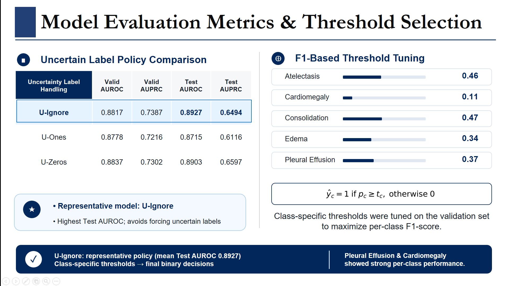
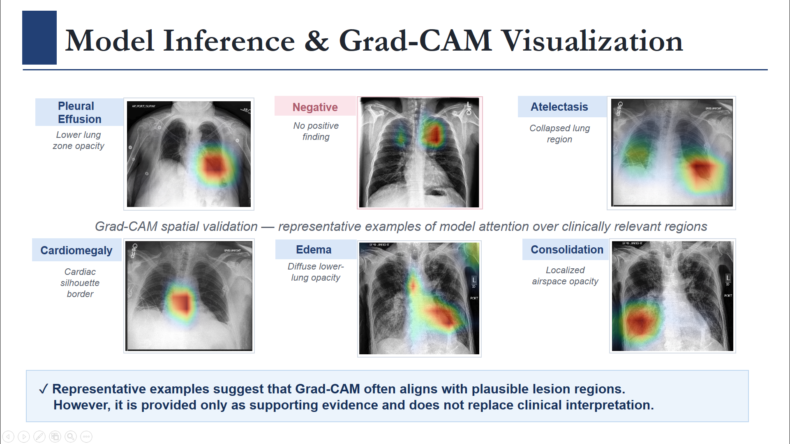

# CheXpert PoC

> DenseNet121-based multi-label Chest X-ray classification pipeline using CheXpert-small.

Research and experiment codebase for model training, evaluation, threshold tuning,
inference, and Grad-CAM validation. The production web service is maintained separately in
[`capstone-cxr`](https://github.com/Laplace-tech/capstone-cxr).

---

## Project Overview

This project trains and evaluates a chest X-ray classification model for five CheXpert target findings:

- Atelectasis
- Cardiomegaly
- Consolidation
- Edema
- Pleural Effusion

The model predicts class-wise probabilities and supports Grad-CAM visualization for explainable inference.

| Item | Description |
|---|---|
| Project Type | Research PoC / Model Experiment Repository |
| Development Period | 2026.03 – 2026.04 |
| Main Task | Multi-label Chest X-ray classification |
| Dataset | CheXpert-small |
| Backbone | DenseNet121 |
| Explainability | Grad-CAM |

## Project Period

This repository was developed as the research and model experimentation phase of the capstone project.

| Phase | Period | Description |
|---|---|---|
| Initial Setup | 2026.03 | Dataset structure setup · Preprocessing policy design · Baseline training pipeline |
| Model Experiments | 2026.03 – 2026.04 | Uncertainty policy comparison · Training refinement · AUROC/AUPRC evaluation · Threshold tuning |
| Inference & Visualization | 2026.04 | Image-level inference · Grad-CAM · Error analysis · Reusable inference logic |

## Main Features

| Stage | Features |
|---|---|
| Data | CheXpert-small loading · Frontal-view-only policy |
| Label Policy | U-Ignore · U-Ones · U-Zero comparison |
| Training | DenseNet121 · `BCEWithLogitsLoss` · `pos_weight` |
| Evaluation | AUROC · AUPRC · F1-based threshold tuning · Error analysis |
| Inference | Image-level prediction · Grad-CAM visualization · Reusable service functions |

## Repository Structure

```text
chexpert_poc/
├── chexpert_poc/
│   ├── common/          # config, runtime, shared utilities
│   ├── datasets/        # CheXpert dataset and label handling
│   ├── evaluation/      # metrics, prediction tables, thresholds
│   ├── explain/         # Grad-CAM logic
│   ├── inference/       # inference, postprocess, artifact handling
│   ├── metrics/         # classification metrics
│   ├── models/          # DenseNet121 model definition
│   └── training/        # dataloader, loss, optimizer, class weights
├── configs/
│   └── base.yaml
├── scripts/
│   ├── check_dataset.py
│   ├── sanity_dataloader.py
│   ├── train.py
│   ├── eval.py
│   ├── threshold_tune.py
│   ├── error_analysis.py
│   ├── infer.py
│   └── gradcam_demo.py
└── README.md
```

## Dataset Policy

The dataset is not included in this repository.

Expected local dataset path:

```text
data/chexpert_small/raw/
├── train.csv
├── valid.csv
├── test_labels.csv
├── train/
├── valid/
└── test/
```

Only frontal-view images are used.

## Target Labels

- Atelectasis
- Cardiomegaly
- Consolidation
- Edema
- Pleural Effusion

## Uncertainty Label Policy

CheXpert contains uncertain labels. This project compares three uncertainty label policies:

| Policy | Description |
|---|---|
| U-Ignore | Exclude uncertain labels from loss calculation |
| U-Ones | Treat uncertain labels as positive |
| U-Zero | Treat uncertain labels as negative |

The representative model uses **U-Ignore** because it achieved the highest test AUROC while avoiding forced positive or negative assignment of uncertain labels.

## Training Setup

| Item | Setting |
|---|---|
| Backbone | DenseNet121 |
| Pretrained | ImageNet |
| Task | Multi-label classification |
| Input size | 320 × 320 |
| Batch size | 32 |
| Epochs | 10 |
| Optimizer | Adam |
| Learning rate | 1e-4 |
| Loss | BCEWithLogitsLoss + pos_weight |
| Metrics | AUROC, AUPRC |
| Threshold tuning | F1 grid search from 0.05 to 0.95 |

## Representative Results

### Uncertainty Policy Comparison

| Policy | Valid AUROC | Valid AUPRC | Test AUROC | Test AUPRC |
|---|---:|---:|---:|---:|
| U-Ignore | 0.8811 | **0.7387** | **0.8927** | 0.6494 |
| U-Ones | 0.8778 | 0.7216 | 0.8715 | 0.6116 |
| U-Zero | **0.8837** | 0.7302 | 0.8903 | **0.6597** |

Representative U-Ignore model:

| Metric | Test Score |
|---|---:|
| Mean AUROC | 0.8927 |
| Mean AUPRC | 0.6494 |

### Model Evaluation and Threshold Selection

<p align="center">
  
</p>

Class-specific thresholds were tuned on the validation set to maximize per-class F1-score.

| Label | Threshold |
|---|---:|
| Atelectasis | 0.46 |
| Cardiomegaly | 0.11 |
| Consolidation | 0.47 |
| Edema | 0.34 |
| Pleural Effusion | 0.37 |

> Thresholds are tuned only on validation predictions. Test predictions are reserved for evaluation.

## Grad-CAM Visualization

Grad-CAM is used to visualize model attention over chest X-ray regions.  
It is provided as supporting evidence and does not replace clinical interpretation.

<p align="center">
  
</p>

---

## Quickstart

### 1. Environment

```bash
python -m venv .venv
source .venv/bin/activate

python -m pip install --upgrade pip
python -m pip install torch torchvision
python -m pip install numpy pandas scikit-learn matplotlib pyyaml pillow tqdm
```

### 2. Dataset Check

```bash
python scripts/check_dataset.py --config configs/base.yaml
```

### 3. Training

```bash
python scripts/train.py --config configs/base.yaml
```

### 4. Validation Evaluation

```bash
python scripts/eval.py \
  --config configs/base.yaml \
  --checkpoint outputs/train_runs/<run_id>/checkpoints/best.pt \
  --split valid
```

### 5. Threshold Tuning

```bash
python scripts/threshold_tune.py \
  --config configs/base.yaml \
  --split valid \
  --pred-csv outputs/train_runs/<run_id>/eval/study_predictions.csv \
  --criterion f1
```

### 6. Inference

```bash
python scripts/infer.py \
  --config configs/base.yaml \
  --checkpoint outputs/train_runs/<run_id>/checkpoints/best.pt \
  --input path/to/image.jpg
```

### 7. Grad-CAM

```bash
python scripts/gradcam_demo.py \
  --config configs/base.yaml \
  --checkpoint outputs/train_runs/<run_id>/checkpoints/best.pt \
  --input path/to/image.jpg \
  --label "Pleural Effusion"
```

---

## Notes

- This repository is for research and proof-of-concept experiments.
- The development period was **2026.03 – 2026.04**.
- It is not a standalone medical device.
- Model outputs should be interpreted only as decision-support information.
- CheXpert data, model checkpoints, logs, and generated outputs are excluded from Git tracking.
